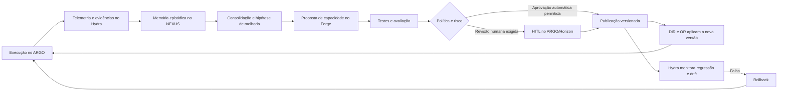

# ACO-RFC-0001 — Agentes Autoevolutivos Governados

## Estado da arte, taxonomia e implicações para a Arquitetura Cognitiva Operacional

> **Status:** Draft  
> **Versão:** 0.1.0  
> **Data:** 10 de julho de 2026  
> **Escopo:** pesquisa arquitetural, proposta conceitual e backlog técnico  
> **Público-alvo:** arquitetos de IA, pesquisadores, engenheiros de agentes, equipes de governança e mantenedores da ACO

---

## 1. Resumo executivo

Agentes baseados em modelos de linguagem deixaram de ser apenas interfaces conversacionais e passaram a executar tarefas, operar ferramentas, consultar memória, decompor objetivos e interagir com ambientes externos. Apesar desse avanço, grande parte dos sistemas atuais permanece essencialmente estática: o modelo base não muda durante a operação e o *harness* que o cerca — prompts, memória, ferramentas, políticas, fluxos e mecanismos de avaliação — costuma ser configurado manualmente.

O paradigma de **agentes autoevolutivos** propõe uma mudança: agentes passam a melhorar a própria capacidade de resolver tarefas a partir de experiência operacional, feedback, resultados, erros e interação com o ambiente. Essa evolução pode ocorrer com ou sem atualização de pesos do modelo. Na prática, os mecanismos mais viáveis no curto prazo concentram-se no *harness*: memória, recuperação, seleção de ferramentas, composição de *skills*, planejamento, políticas, roteamento e autoavaliação.

Esta RFC sustenta que autoevolução não deve ser tratada como autonomia irrestrita. Em contextos organizacionais, a evolução precisa ser **governada, observável, reversível e baseada em evidências**. Assim, propõe-se o conceito de **Agente Autoevolutivo Governado**: um agente capaz de modificar artefatos do próprio sistema cognitivo dentro de limites explícitos, sob políticas, avaliação, versionamento, auditoria e controle humano proporcional ao risco.

A Arquitetura Cognitiva Operacional (ACO) oferece uma base especialmente adequada para esse paradigma, pois já separa responsabilidades entre componentes distintos:

- **ARGO**: criação, publicação, operação e supervisão de agentes;
- **Forge**: publicação, descoberta, governança e composição de capacidades executáveis;
- **NEXUS**: memória viva, consolidação e publicação de conhecimento;
- **DIR**: decisão cognitiva, refino de entrada e roteamento por custo, qualidade e risco;
- **OR-OmniRouter**: controle de inferência e resiliência entre modelos e provedores;
- **Hydra**: observabilidade cognitiva, auditoria, avaliação, drift, qualidade e custos;
- **DataHunter**: descoberta e curadoria de fontes externas;
- **Horizon**: experiência, interação e acesso unificado às capacidades cognitivas.

A principal conclusão é que a ACO não precisa introduzir um novo componente monolítico chamado “Self-Evolution Engine”. A autoevolução deve emergir como uma **capacidade transversal**, implementada por um ciclo governado entre observação, avaliação, memória, proposição de mudança, validação, publicação e monitoramento.

---

## 2. Objetivo

Esta RFC tem cinco objetivos:

1. definir o conceito de agente autoevolutivo de forma arquiteturalmente útil;
2. sintetizar mecanismos relevantes da literatura científica;
3. distinguir melhoria em tempo de execução, aprendizagem persistente e atualização de modelo;
4. mapear capacidades de autoevolução para os componentes da ACO;
5. propor requisitos e um backlog inicial para agentes autoevolutivos governados.

Esta RFC não estabelece ainda uma decisão definitiva de arquitetura. Seu status é **Draft** e sua função é subsidiar discussão, experimentação e futuros ADRs.

---

## 3. Motivação

### 3.1 Limitação dos agentes estáticos

Um agente convencional pode ser representado, de forma simplificada, por:

```text
Agente = Modelo + Harness + Estado + Ambiente
```

Onde:

- **Modelo**: LLM ou conjunto de modelos usados para inferência;
- **Harness**: prompts, ferramentas, memória, fluxos, políticas, avaliadores e mecanismos de controle;
- **Estado**: contexto atual da tarefa e histórico relevante;
- **Ambiente**: APIs, usuários, sistemas, documentos, bancos de dados e demais fontes de interação.

Mesmo quando o modelo é sofisticado, o agente tende a repetir padrões de falha quando o *harness* não registra experiência, não avalia resultados ou não transforma feedback em melhoria persistente.

### 3.2 Da execução para a evolução

A autoevolução adiciona um segundo ciclo ao runtime do agente:

```text
Ciclo operacional:
Objetivo → Planejamento → Ação → Resultado

Ciclo evolutivo:
Resultado → Avaliação → Evidência → Proposta de mudança → Validação → Publicação → Monitoramento
```

A distinção é importante. Nem toda reflexão é aprendizagem, nem toda memória é evolução, nem toda mudança automática é melhoria.

Para que exista evolução persistente, deve ocorrer ao menos uma modificação durável em um artefato reutilizável, como:

- uma memória consolidada;
- uma política;
- uma estratégia de roteamento;
- uma ferramenta;
- uma *skill*;
- um workflow;
- um prompt versionado;
- um conjunto de testes;
- um adaptador;
- ou os próprios parâmetros do modelo.

---

## 4. Definições normativas

### 4.1 Agente autoevolutivo

Um **agente autoevolutivo** é um sistema agente capaz de usar experiência operacional para propor, avaliar e persistir mudanças em um ou mais elementos que condicionam seu comportamento futuro.

### 4.2 Agente autoevolutivo governado

Um **agente autoevolutivo governado** é um agente autoevolutivo cuja capacidade de mudança é submetida a:

- escopo explícito de mutação;
- identidade e proveniência;
- políticas de autorização;
- testes e critérios de aceitação;
- avaliação de risco;
- versionamento;
- observabilidade;
- reversibilidade;
- aprovação humana quando exigida;
- monitoramento pós-publicação.

### 4.3 Evolução

Nesta RFC, **evolução** significa mudança persistente e reutilizável no sistema cognitivo. Não implica necessariamente melhoria garantida, aprendizado biológico ou atualização paramétrica.

### 4.4 Reflexão

**Reflexão** é a produção de uma análise sobre ações, resultados ou erros. Ela pode apoiar evolução, mas não a constitui isoladamente.

### 4.5 Harness

**Harness** é o conjunto de mecanismos externos ao modelo que estrutura o comportamento do agente: prompts, ferramentas, memória, políticas, workflows, avaliadores, roteadores, guardrails e mecanismos de controle.

### 4.6 Skill

Uma **skill** é uma capacidade executável, reutilizável, versionada e testável, com contrato de entrada, saída, dependências, permissões e critérios de qualidade.

---

## 5. Taxonomia de autoevolução

### 5.1 O que evolui

| Alvo de evolução | Exemplos | Persistência | Risco |
|---|---|---:|---:|
| Contexto imediato | resumo, scratchpad, plano atual | baixa | baixo |
| Memória episódica | trajetória, erro, resultado | média | médio |
| Memória semântica | regra consolidada, conhecimento extraído | alta | médio |
| Memória procedural | procedimento reutilizável | alta | alto |
| Prompt | instrução de sistema, template, few-shot | alta | médio |
| Ferramenta | API wrapper, função, conector | alta | alto |
| Skill | composição de ferramentas e políticas | alta | alto |
| Workflow | grafo de execução e validação | alta | alto |
| Política | autorização, roteamento, risco | alta | crítico |
| Arquitetura | papéis, componentes e coordenação | alta | crítico |
| Modelo | fine-tuning, adapters, RL | alta | crítico |

### 5.2 Quando ocorre

- **Intra-task**: durante uma única tarefa, sem persistência necessária;
- **Inter-task**: entre execuções, com reaproveitamento da experiência;
- **Online**: durante a operação produtiva;
- **Offline**: em janelas controladas de consolidação e treinamento;
- **Event-driven**: após falha, drift, baixa confiança ou intervenção humana;
- **Scheduled**: em ciclos periódicos de revisão e publicação.

### 5.3 Como ocorre

- feedback textual;
- recompensa escalar;
- comparação entre alternativas;
- testes automatizados;
- validação por modelo avaliador;
- validação humana;
- distilação de trajetórias;
- síntese de regras;
- mineração de padrões;
- otimização de prompts;
- aprendizagem por reforço;
- coevolução entre agentes.

### 5.4 Granularidade da avaliação

A avaliação pode ocorrer apenas no resultado final ou ao longo do processo.

- **Outcome-based**: avalia sucesso, erro, custo, latência ou satisfação final;
- **Process-based**: avalia passos, decisões, uso de ferramentas, fontes, verificações e violações intermediárias.

A ACO deve privilegiar avaliação processual em tarefas críticas, pois um resultado aparentemente correto pode ter sido produzido por uma trajetória não confiável.

---

## 6. Estado da arte

### 6.1 ReAct

ReAct integra raciocínio e ação em trajetórias intercaladas, permitindo que o agente atualize o plano ao observar resultados de ferramentas e do ambiente. Embora não seja, por si só, um mecanismo de evolução persistente, estabelece o padrão operacional necessário para capturar trajetórias úteis à aprendizagem posterior.

**Contribuição para a ACO:** estrutura de eventos cognitivos para ARGO e Hydra; registro de decisões, ações, observações e revisões.

### 6.2 Reflexion

Reflexion introduz reforço verbal: o agente analisa feedback, produz reflexões em linguagem natural e armazena essas reflexões em memória episódica para melhorar tentativas futuras, sem atualizar os pesos do modelo.

**Contribuição para a ACO:** reforça o papel do NEXUS na persistência de experiências e do Hydra na geração de evidências avaliativas. A reflexão não deve ser gravada automaticamente como conhecimento sem curadoria.

### 6.3 Self-Refine

Self-Refine utiliza o próprio modelo como gerador, crítico e refinador. O método demonstra que ciclos iterativos de feedback podem elevar a qualidade sem treinamento adicional.

**Contribuição para a ACO:** padrão de refinamento local, útil em ARGO e DIR. Como limitação, a crítica gerada pelo próprio modelo pode reproduzir os mesmos vieses da resposta inicial.

### 6.4 Voyager

Voyager combina currículo automático, biblioteca crescente de skills e refinamento por feedback do ambiente. A contribuição mais relevante é transformar soluções bem-sucedidas em habilidades executáveis e reutilizáveis.

**Contribuição para a ACO:** fundamenta o Forge como registro e lifecycle de skills, enquanto NEXUS preserva a experiência e Hydra mede desempenho, regressões e transferência.

### 6.5 Generative Agents

Generative Agents demonstra uma arquitetura com observação, armazenamento de memória, recuperação, reflexão e planejamento. A importância do trabalho está na articulação entre memória episódica e reflexões de nível superior.

**Contribuição para a ACO:** fundamenta o pipeline de consolidação do NEXUS, mas a ACO amplia o modelo ao exigir proveniência, lifecycle, publicação e governança organizacional.

### 6.6 Surveys de agentes autoevolutivos

A literatura recente organiza agentes autoevolutivos pelas perguntas “o que evolui”, “quando evolui” e “como evolui”. Essa taxonomia desloca o debate da atualização de pesos para uma visão sistêmica que inclui memória, ferramentas, arquitetura e coordenação multiagente.

**Contribuição para a ACO:** confirma que a unidade de evolução não é apenas o modelo, mas o sistema cognitivo completo.

---

## 7. Limitações e riscos

### 7.1 Autoavaliação não confiável

Um agente pode considerar correta uma solução incorreta. Avaliadores baseados em LLMs também podem compartilhar vieses com o agente avaliado. Portanto, a ACO deve usar avaliação multimétodo: testes determinísticos, regras, evidências externas, comparação entre modelos e revisão humana quando necessário.

### 7.2 Contaminação de memória

Uma experiência isolada pode ser consolidada como regra geral. Memória falsa ou não verificada pode contaminar decisões futuras. O NEXUS deve diferenciar claramente:

- observação;
- hipótese;
- reflexão;
- conhecimento validado;
- procedimento aprovado.

### 7.3 Regressão comportamental

Uma mudança pode melhorar uma classe de tarefas e degradar outra. Toda evolução deve possuir conjunto de testes de regressão e critérios de rollback.

### 7.4 Escalada de privilégios

A criação automática de ferramentas ou workflows pode ampliar permissões indevidamente. O Forge deve exigir contratos, escopos de autorização, sandbox, análise de dependências e assinatura de artefatos.

### 7.5 Otimização para métricas inadequadas

Agentes podem maximizar indicadores locais e piorar objetivos organizacionais. Hydra deve registrar métricas técnicas e de resultado, incluindo qualidade, risco, custo, latência, confiabilidade, satisfação e impacto operacional.

### 7.6 Drift de políticas

Políticas não devem ser modificadas pelo mesmo agente sujeito a elas. Mudanças em políticas críticas exigem separação de funções, revisão e aprovação explícita.

---

## 8. Princípios arquiteturais propostos

1. **Evolução como mudança versionada:** nenhuma alteração persistente deve existir fora de um artefato versionado.
2. **Evidência antes da promoção:** experiências só se tornam conhecimento ou skill após avaliação apropriada.
3. **Separação entre proposta e autorização:** o agente pode propor mudanças; a autorização pertence à política de governança.
4. **Reversibilidade por padrão:** toda mudança promovida deve possuir versão anterior recuperável.
5. **Escopo mínimo de mutação:** agentes só podem alterar os objetos explicitamente autorizados.
6. **Avaliação proporcional ao risco:** quanto maior o impacto potencial, maior a exigência de testes e revisão humana.
7. **Observabilidade integral:** decisões, evidências, versões e consequências devem ser rastreáveis.
8. **Aprendizagem sem perda de soberania:** dados, memórias e artefatos devem respeitar domínio, privacidade, retenção e jurisdição.
9. **Conhecimento não é log:** eventos operacionais não devem ser promovidos automaticamente a conhecimento.
10. **Modelo não é o sistema:** o comportamento resulta da composição entre modelo, memória, ferramentas, políticas e ambiente.

---

## 9. Proposta para a ACO

### 9.1 Autoevolução como capacidade transversal

A ACO deve implementar autoevolução como um ciclo distribuído:



### 9.2 Responsabilidade por componente

| Componente | Responsabilidade na autoevolução |
|---|---|
| **ARGO** | executar agentes; capturar trajetórias; coordenar crítica, validação e HITL; aplicar versões aprovadas |
| **Forge** | registrar, testar, versionar, assinar, publicar e depreciar prompts, ferramentas, skills e workflows |
| **NEXUS** | armazenar experiência; consolidar memória; distinguir observação, reflexão, conhecimento e procedimento |
| **DIR** | selecionar estratégia, modelo, política e versão de capacidade conforme tarefa, risco e estado cognitivo |
| **OR-OmniRouter** | garantir inferência resiliente, controlar custo e aplicar políticas de fallback durante experimentos |
| **Hydra** | coletar evidências; avaliar desempenho; detectar drift; comparar versões; auditar evolução e acionar rollback |
| **DataHunter** | fornecer evidências externas curadas para validar ou refutar aprendizados |
| **Horizon** | apresentar revisões, aprovações, explicações e histórico de evolução para usuários autorizados |

### 9.3 Objeto arquitetural: Evolution Proposal

Propõe-se introduzir o objeto arquitetural **Evolution Proposal**, com os seguintes campos mínimos:

```yaml
id: evolution-proposal-uuid
source_agent: agent-id
source_version: 1.4.2
target_object_type: skill
target_object_id: document-analysis-skill
change_type: update
problem_statement: "Falha recorrente na extração de tabelas complexas"
evidence_refs:
  - hydra-trace-001
  - nexus-episode-784
proposed_change_ref: forge-artifact-candidate-91
expected_benefit:
  metric: table_extraction_f1
  baseline: 0.71
  target: 0.82
risk_class: medium
tests_required:
  - regression-suite-table-extraction
  - security-sandbox
approval_policy: human-review
rollback_ref: document-analysis-skill@1.4.2
status: proposed
```

### 9.4 Estados do lifecycle

```text
Observed
→ Analyzed
→ Proposed
→ Tested
→ Reviewed
→ Approved
→ Published
→ Monitored
→ Retained | Rolled Back | Deprecated
```

---

## 10. Níveis de autonomia evolutiva

| Nível | Descrição | Exemplo | Aprovação |
|---|---|---|---|
| **E0 — Estático** | sem mudança persistente | agente convencional | não aplicável |
| **E1 — Reflexivo** | gera crítica, sem persistência promovida | Self-Refine local | automática |
| **E2 — Memorioso** | persiste experiência e reflexão | memória episódica | automática com política |
| **E3 — Adaptativo** | altera seleção de estratégia ou recuperação | ajuste de roteamento | automática limitada |
| **E4 — Compositivo** | cria ou modifica skills e workflows | nova composição no Forge | testes + política |
| **E5 — Autoprogramável** | cria código, conectores ou ferramentas | nova ferramenta executável | revisão obrigatória |
| **E6 — Autoarquitetural** | altera topologia, papéis ou políticas centrais | mudança de coordenação MAS | governança reforçada |
| **E7 — Paramétrico** | atualiza pesos ou adaptadores | fine-tuning/RL | pipeline de MLOps e aprovação |

A ACO deve iniciar por E1–E4. E5–E7 exigem controles adicionais e não devem ser habilitados por padrão.

---

## 11. Matriz de contribuição da literatura para a ACO

| Trabalho | Mecanismo central | ARGO | Forge | NEXUS | DIR | Hydra |
|---|---|---:|---:|---:|---:|---:|
| ReAct | raciocínio e ação intercalados | alta | baixa | média | média | alta |
| Reflexion | reflexão verbal e memória episódica | alta | baixa | alta | média | alta |
| Self-Refine | crítica e revisão iterativa | alta | baixa | baixa | alta | média |
| Voyager | currículo, feedback e biblioteca de skills | alta | alta | alta | média | alta |
| Generative Agents | memória, reflexão e planejamento | média | baixa | alta | média | média |
| Survey de Self-Evolving Agents | taxonomia sistêmica de evolução | alta | alta | alta | alta | alta |

---

## 12. Backlog arquitetural inicial

### Prioridade P0 — Fundamentos

- definir schema normativo de eventos cognitivos;
- definir schema do objeto `Evolution Proposal`;
- classificar artefatos mutáveis e não mutáveis;
- criar política de promoção de memória episódica para semântica/procedural;
- implementar versionamento e rollback de prompts, skills e workflows no Forge;
- implementar comparação de versões e regressão no Hydra;
- registrar proveniência completa entre execução, evidência, proposta e publicação.

### Prioridade P1 — Evolução governada do harness

- otimização de prompts com testes controlados;
- seleção adaptativa de tools e skills;
- consolidação de trajetórias bem-sucedidas em procedimentos candidatos;
- avaliação por múltiplos julgadores e testes determinísticos;
- canary release de novas versões de skills;
- aprovação HITL baseada em risco;
- dashboard de evolução no Horizon.

### Prioridade P2 — Evolução de workflows

- síntese de workflows candidatos;
- comparação entre grafos de execução;
- simulação offline;
- detecção automática de loops, deadlocks e dependências inseguras;
- aprendizado de políticas de roteamento no DIR;
- rollback automático orientado por SLO.

### Prioridade P3 — Pesquisa avançada

- coevolução multiagente;
- geração controlada de ferramentas;
- distilação de memória procedural em modelos menores;
- aprendizagem paramétrica sob governança;
- formalização de invariantes de segurança;
- benchmarks próprios para continuidade cognitiva e evolução governada.

---

## 13. Critérios de aceitação para experimentos

Um experimento de autoevolução na ACO deve demonstrar:

1. melhoria estatisticamente ou operacionalmente relevante em métrica definida;
2. ausência de regressão crítica no conjunto de testes;
3. rastreabilidade entre evidência e mudança;
4. capacidade de rollback;
5. respeito a políticas de acesso e privacidade;
6. custo de evolução mensurado;
7. explicação da mudança em linguagem acessível ao revisor;
8. monitoramento pós-publicação;
9. separação entre ambiente experimental e produção;
10. registro da decisão de promoção ou rejeição.

---

## 14. Métricas recomendadas

### 14.1 Qualidade

- taxa de sucesso por classe de tarefa;
- precisão, recall e F1 quando aplicáveis;
- groundedness e factualidade;
- qualidade de trajetória;
- taxa de intervenção humana;
- taxa de recuperação após erro.

### 14.2 Eficiência

- custo por tarefa;
- tokens por tarefa;
- latência total;
- número de chamadas de modelo;
- reutilização de skills;
- redução de tentativas repetidas.

### 14.3 Evolução

- ganho sobre baseline;
- taxa de propostas aprovadas;
- taxa de rollback;
- tempo entre evidência e publicação;
- transferência entre domínios;
- persistência do ganho ao longo do tempo;
- regressão em tarefas não alvo.

### 14.4 Governança

- completude de proveniência;
- violações de política;
- alterações sem aprovação requerida;
- cobertura de testes;
- explicabilidade da mudança;
- conformidade de retenção e soberania.

---

## 15. Questões em aberto

- Como distinguir conhecimento generalizável de adaptação excessiva a casos recentes?
- Como medir a qualidade de uma memória consolidada antes de sua reutilização ampla?
- Qual deve ser a unidade mínima versionável: prompt, skill, workflow ou política?
- Como evitar que agentes e avaliadores compartilhem o mesmo viés?
- Como representar incerteza, conflito e obsolescência no NEXUS?
- Quais mudanças podem ser promovidas automaticamente em cada classe de risco?
- Como comparar evolução do harness com fine-tuning em custo total e confiabilidade?
- Como auditar coevolução em sistemas multiagentes?
- Como impedir otimização oportunista de métricas?
- Como transformar experiências em conhecimento sem apagar contexto e exceções?

---

## 16. Decisões recomendadas para futuros ADRs

Esta RFC recomenda a criação posterior dos seguintes ADRs:

1. **ADR — Autoevolução como capacidade transversal, não como componente monolítico**;
2. **ADR — Evolution Proposal como objeto arquitetural de primeira classe**;
3. **ADR — Separação entre memória episódica, reflexão, conhecimento e procedimento**;
4. **ADR — Forge como autoridade de publicação de artefatos executáveis**;
5. **ADR — Hydra como autoridade de evidência, avaliação e rollback**;
6. **ADR — Políticas críticas não podem ser autoalteradas pelo agente governado por elas**;
7. **ADR — Evolução produtiva deve usar rollout progressivo e regressão contínua**.

---

## 17. Conclusão

Agentes autoevolutivos representam uma mudança de foco: da inteligência concentrada no modelo para a inteligência distribuída no sistema. A evolução mais viável e controlável, no curto prazo, ocorrerá principalmente no harness — memória, prompts, ferramentas, skills, workflows, políticas de seleção e mecanismos de avaliação.

A ACO possui uma vantagem arquitetural relevante porque já separa memória, capacidades, decisão, inferência, observabilidade, curadoria de dados, operação de agentes e experiência humana. Essa decomposição permite que a evolução seja tratada como um ciclo governado entre componentes especializados, em vez de uma capacidade opaca embutida em um agente monolítico.

A proposta central desta RFC é que a ACO adote o conceito de **Sistemas Cognitivos Autoevolutivos Governados**, preservando quatro propriedades não negociáveis: evidência, controle, reversibilidade e responsabilidade. O agente pode aprender e propor mudanças; a arquitetura decide como essas mudanças são testadas, autorizadas, publicadas e monitoradas.

---

## Referências

GAO, Huan-ang et al. **A survey of self-evolving agents: on path to artificial super intelligence**. [S. l.]: arXiv, 2025. Preprint arXiv:2507.21046. Disponível em: https://arxiv.org/abs/2507.21046. Acesso em: 10 jul. 2026.

MADAAN, Aman et al. **Self-refine: iterative refinement with self-feedback**. [S. l.]: arXiv, 2023. Preprint arXiv:2303.17651. Disponível em: https://arxiv.org/abs/2303.17651. Acesso em: 10 jul. 2026.

PARK, Joon Sung et al. **Generative agents: interactive simulacra of human behavior**. In: ANNUAL ACM SYMPOSIUM ON USER INTERFACE SOFTWARE AND TECHNOLOGY, 36., 2023, San Francisco. *Proceedings [...]*. New York: Association for Computing Machinery, 2023. Disponível em: https://arxiv.org/abs/2304.03442. Acesso em: 10 jul. 2026.

SHINN, Noah et al. **Reflexion: language agents with verbal reinforcement learning**. In: CONFERENCE ON NEURAL INFORMATION PROCESSING SYSTEMS, 37., 2023. *Proceedings [...]*. [S. l.]: NeurIPS, 2023. Disponível em: https://arxiv.org/abs/2303.11366. Acesso em: 10 jul. 2026.

WANG, Guanzhi et al. **Voyager: an open-ended embodied agent with large language models**. [S. l.]: arXiv, 2023. Preprint arXiv:2305.16291. Disponível em: https://arxiv.org/abs/2305.16291. Acesso em: 10 jul. 2026.

YAO, Shunyu et al. **ReAct: synergizing reasoning and acting in language models**. In: INTERNATIONAL CONFERENCE ON LEARNING REPRESENTATIONS, 2023. *Proceedings [...]*. [S. l.]: ICLR, 2023. Disponível em: https://arxiv.org/abs/2210.03629. Acesso em: 10 jul. 2026.

---

## Apêndice A — Checklist de governança de evolução

- [ ] O alvo da mudança está explicitamente identificado?
- [ ] O agente possui autorização para propor alteração nesse alvo?
- [ ] As evidências são rastreáveis e suficientes?
- [ ] A proposta diferencia hipótese de fato validado?
- [ ] Existe conjunto de testes relevante?
- [ ] Há avaliação de segurança e privacidade?
- [ ] O risco foi classificado?
- [ ] A política de aprovação foi aplicada?
- [ ] A versão anterior pode ser restaurada?
- [ ] O rollout será progressivo?
- [ ] Existem métricas e SLOs pós-publicação?
- [ ] O Hydra pode detectar regressão e acionar rollback?
- [ ] A mudança foi registrada no NEXUS e no Forge com proveniência?
- [ ] A decisão humana, quando exigida, foi registrada?

---

## Apêndice B — Status documental

Este documento é uma RFC de pesquisa em estado **Draft**. Suas propostas não alteram automaticamente a especificação canônica da ACO. Decisões normativas deverão ser formalizadas por ADRs e incorporadas à documentação oficial após revisão.