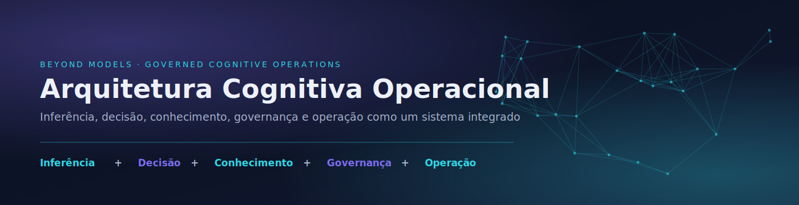
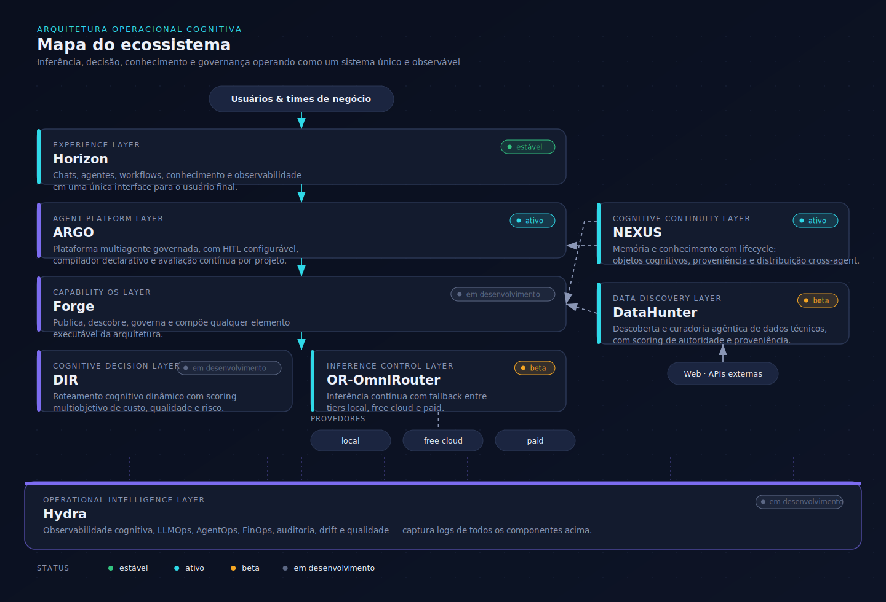
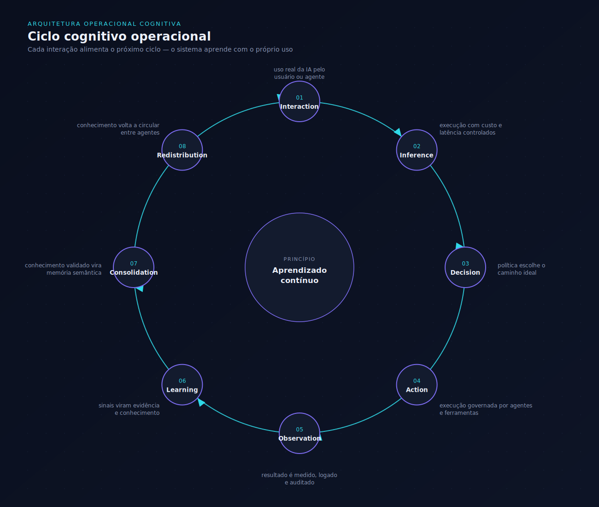
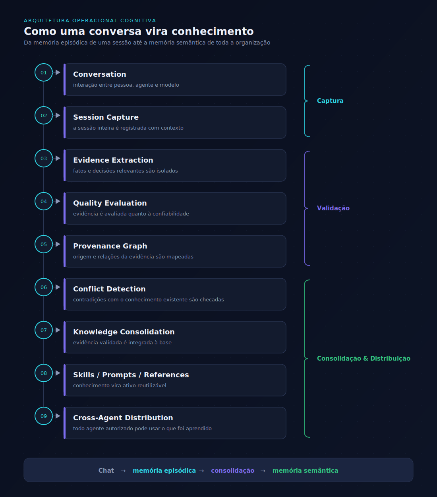

<div align="center">
  
</div>

<br/>

## Resumo executivo

A **1-AI-Ecosystem-Lab** desenvolve a **Arquitetura Operacional Cognitiva (ACO)**: uma infraestrutura que trata IA generativa como uma **operação governada e observável**, não como uma coleção de chamadas a modelos.

À medida que empresas migram de chats isolados para agentes e sistemas multiagentes, os problemas deixam de ser "qual modelo usar" e passam a ser **custo de inferência descontrolado, decisões não rastreáveis, conhecimento perdido entre sessões e ausência de governança sobre dados, privacidade e risco**. A ACO endereça isso com um conjunto de componentes modulares — hoje já em operação real, não apenas em design — que cobrem inferência, decisão, memória, execução multiagente e observabilidade de ponta a ponta.

Este README é a porta de entrada da arquitetura: o que já está rodando, como as peças se conectam, e por que o modelo de governança-como-infraestrutura é a próxima fronteira além de "só criar mais um agente".

<br/>

## A lacuna nas arquiteturas de raciocínio atuais

A ACO nasce de uma pesquisa sobre arquiteturas de raciocínio em IA, que identificou quatro limitações estruturais nos sistemas hoje predominantes — e cada componente da arquitetura existe para responder a uma delas.

| Limitação identificada | Como a ACO responde |
|---|---|
| **Aprendizado finito** — o conhecimento gerado numa interação se perde ao final dela | **NEXUS** trata conhecimento como objeto com lifecycle e proveniência, consolidando memória episódica em semântica |
| **Excesso de uso de inferência** — cada decisão dispara nova chamada ao modelo, mesmo quando o conhecimento já existe | **DIR** + **OR-OmniRouter** roteiam por custo, qualidade e risco, evitando reprocessar o que já foi aprendido |
| **Sistema passivo, não ativo** — a IA responde, mas não participa da evolução do conhecimento nem da melhoria das decisões ao longo do tempo | **ARGO** (HITL) + **Hydra** fecham o loop: o sistema observa, aprende e realimenta decisões futuras |
| **Falta de governança e visibilidade sobre a abordagem neural dentro do raciocínio** — não é só "quem usou o quê", é como componentes neurais influenciam a decisão internamente | **Governança cognitiva transversal** + **Hydra** (auditoria, drift, qualidade) tornam essa influência rastreável, não uma caixa-preta |

### De IHM para IHIAM

O modelo clássico de **IHM — Interface Homem-Máquina** — pressupõe um humano operando uma máquina determinística. Em sistemas cognitivos, a IA deixa de ser apenas interface e passa a atuar como agente dentro do próprio processo de decisão.

A ACO é desenhada para o paradigma **IHIAM — Interface Homem-IA-Máquina**: a IA participa ativamente da evolução do conhecimento e da tomada de decisão, não apenas media o comando do humano para a máquina.

<br/>

## Onde cada componente está hoje

| Componente | Camada | Papel em uma frase | Status |
|---|---|---|---|
| **Horizon** | Experience | Interface única para chats, agentes, workflows e observabilidade |  |
| **ARGO** | Agent Platform | Plataforma multiagente governada com HITL configurável |  |
| **NEXUS** | Cognitive Continuity | Memória e conhecimento com lifecycle e proveniência |  |
| **OR-OmniRouter** | Inference Control | Inferência contínua com fallback entre tiers local / free / paid |  |
| **DataHunter** | Data Discovery | Descoberta e curadoria agêntica de dados técnicos |  |
| **Forge** | Capability OS | Publica, descobre e compõe qualquer elemento executável da ACO |  |
| **DIR** | Cognitive Decision | Roteamento cognitivo dinâmico por custo, qualidade e risco |  |
| **Hydra** | Operational Intelligence | Observabilidade, LLMOps, AgentOps, FinOps e auditoria |  |

<br/>

## Por que isso existe

Usar IA não é apenas selecionar um modelo.

À medida que empresas e equipes passam de chats isolados para copilots, agentes e sistemas multiagentes, surgem novos desafios:

- fragmentação entre ferramentas, modelos e agentes;
- aumento de custo por uso inadequado de inferência;
- baixa rastreabilidade das decisões;
- conhecimento preso em conversas e plataformas;
- dificuldade de governar privacidade, soberania, qualidade e risco;
- ausência de observabilidade cognitiva ponta a ponta.

A proposta da Arquitetura Operacional Cognitiva é tratar IA como uma **infraestrutura operacional governada**, e não apenas como uma coleção de APIs.

A arquitetura combina:

- inferência contínua;
- decisão cognitiva dinâmica;
- execução multiagente governada;
- memória e conhecimento com lifecycle;
- observabilidade, auditoria e FinOps;
- governança transversal.

> **Princípio central**
> `Uso da IA Generativa = inferência + decisão + conhecimento + governança + operação`

<br/>

## Conceitos fundamentais

| Conceito | Papel |
|---|---|
| **Modelo** | Capacidade técnica: coding, reasoning, long-context, vision, tool calling, baixa latência, baixo custo ou privacidade local. |
| **Política** | Critério operacional: local-first, cost-first, quality-first, privacy-first, premium-only, dual-pass, audit-required ou low-latency. |
| **Agente / MAS** | Execução de um ou mais papéis cognitivos: planner, coder, reviewer, researcher, support ou orchestrator. |
| **Estado Cognitivo** | Condição atual da tarefa: simple, complex, sensitive, critical, uncertain, long-context, tool-use ou exploratory. |

Sistemas de IA maduros não apenas processam dados — eles precisam **capturar, validar, consolidar e distribuir conhecimento com rastreabilidade**:

| Camada | Papel |
|---|---|
| Dados | fatos |
| Informação | contexto |
| Conhecimento | padrões |
| Cognição | decisão |
| Governança Cognitiva | lifecycle + soberania |

<br/>

## Mapa do ecossistema

<div align="center">
  
</div>

| Camada | Projeto | Papel | Status |
|---|---|---|---|
| Experience Layer | Horizon | Hub de experiência cognitiva para chats, agentes, workflows, conhecimento e observabilidade | estável |
| Agent Platform Layer | ARGO | Plataforma multiagente governada com HITL configurável, compilador declarativo e avaliação contínua por projeto | ativo |
| Capability OS Layer | Forge | OS de capacidades — publica, descobre, governa e compõe qualquer elemento executável da ACO | em desenvolvimento |
| Cognitive Decision Layer | DIR | Motor de roteamento cognitivo dinâmico com scoring multiobjetivo de custo, qualidade e risco | em desenvolvimento |
| Inference Control Layer | OR-OmniRouter | Camada de inferência contínua com fallback entre tiers local, free cloud e paid | beta |
| Data Discovery Layer | DataHunter | Agente de descoberta e curadoria de dados técnicos com scoring de autoridade e proveniência | beta |
| Cognitive Continuity Layer | NEXUS | Infraestrutura de continuidade cognitiva: Cognitive Objects, Fabrics, lifecycle, proveniência e distribuição cross-agent | ativo |
| Operational Intelligence Layer | Hydra | Observabilidade cognitiva, LLMOps, AgentOps, FinOps, auditoria, drift e qualidade | em desenvolvimento |

**Por onde começar**

| Objetivo | Projeto |
|---|---|
| Consumir LLMs com resiliência e fallback automático | OR-OmniRouter |
| Criar e operar agentes com supervisão humana | ARGO |
| Descobrir datasets e evidências técnicas | DataHunter |
| Ter uma interface para conversar com qualquer LLM | Horizon |
| Preservar conhecimento entre sessões e agentes | NEXUS |

<br/>

## Ciclo cognitivo operacional

Esse ciclo conecta uso, decisão, ação, observação e aprendizado contínuo — cada interação alimenta o próximo ciclo.

<div align="center">
  
</div>

<br/>

## Como conversas viram conhecimento

<div align="center">
  
</div>

<br/>

## Governança cognitiva transversal

A governança não é uma camada posterior. Ela atravessa todo o ecossistema.

| Domínio | Exemplos |
|---|---|
| Segurança | RBAC, segredos, menor privilégio, isolamento |
| Dados | LGPD, sensibilidade, retenção, soberania |
| Modelos | provedores autorizados, tiers, fallback permitido |
| Agentes | escopo, ferramentas, autonomia, HITL obrigatório |
| Conhecimento | proveniência, validade, conflito, decay |
| Custos | budget, quota, FinOps, paid fallback |
| Qualidade | evals, validação, grounding, regressão |
| Auditoria | ledger, rastreabilidade, logs, decisões |
| Operação | SLO, incidentes, runbooks, monitoramento |

<br/>

## Evolução da IA

```
LLMs → APIs → copilots → agents → multi-agent systems → cognitive infrastructure
```

A próxima fronteira não é apenas criar agentes. É operar **sistemas cognitivos governados, observáveis e economicamente sustentáveis**.

<br/>

## Direção estratégica

A 1-AI-Ecosystem-Lab explora a construção de uma arquitetura para:

- otimizar o uso de inferência;
- reduzir custo real de entrega;
- governar agentes e sistemas multiagentes;
- preservar conhecimento entre ferramentas e sessões;
- aplicar políticas de soberania, privacidade e qualidade;
- observar operações cognitivas ponta a ponta;
- criar sistemas progressivamente mais adaptativos.

> O futuro da IA não será definido apenas pelos modelos. Será definido pela capacidade de **operar cognição governada em escala**.
>
> **Arquitetura Operacional Cognitiva = Inferência + Decisão + Conhecimento + Governança + Operação**

<br/>

## Fale com a gente

Interessado em conhecer a arquitetura em mais detalhes, uma demonstração ou uma conversa técnica?

📧 `[seu e-mail aqui]` · 💼 `[link do LinkedIn aqui]`

