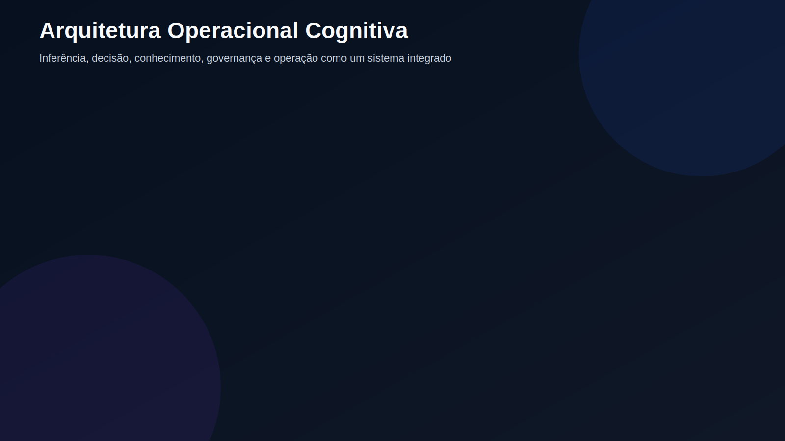
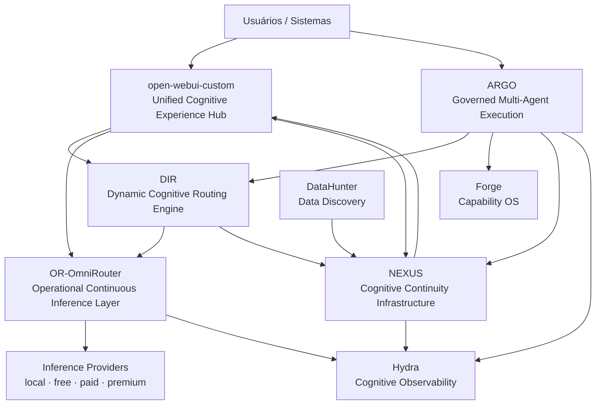
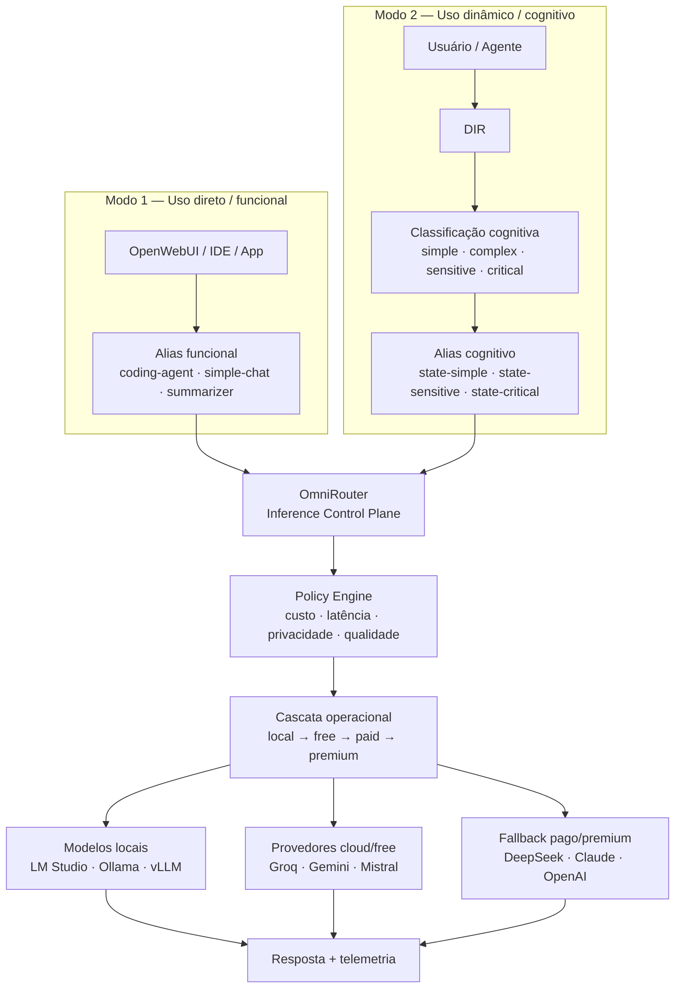

# Arquitetura Operacional Cognitiva

**Inferência, decisão, conhecimento e governança como um sistema operacional contínuo para IA.**

> *Beyond models: governed cognitive operations.*

<p align="center">
  
</p>

A **1-AI-Ecosystem-Lab** organiza projetos, padrões e componentes para construir sistemas de IA que vão além do uso isolado de modelos. O foco é estruturar uma arquitetura modular capaz de operar inferência, agentes, conhecimento, governança e observabilidade de forma integrada.

---

## Por que isso existe?

Usar IA não é apenas selecionar um modelo.

À medida que empresas e equipes passam de chats isolados para copilots, agentes e sistemas multiagentes, surgem novos desafios:

- fragmentação entre ferramentas, modelos e agentes;
- aumento de custo por uso inadequado de inferência;
- baixa rastreabilidade das decisões;
- conhecimento preso em conversas e plataformas;
- dificuldade de governar privacidade, soberania, qualidade e risco;
- ausência de observabilidade cognitiva ponta a ponta.

A proposta da Arquitetura Operacional Cognitiva é tratar IA como uma **infraestrutura operacional governada**, e não apenas como uma coleção de APIs.

---

## Princípio central

```text
Uso da IA Generativa = inferência + decisão + conhecimento + governança + operação
```

A arquitetura combina:

- **inferência contínua**;
- **decisão cognitiva dinâmica**;
- **execução multiagente governada**;
- **memória e conhecimento com lifecycle**;
- **observabilidade, auditoria e FinOps**;
- **governança transversal**.

---

## Conceitos fundamentais

| Conceito | Papel |
| --- | --- |
| **Modelo** | Capacidade técnica: coding, reasoning, long-context, vision, tool calling, baixa latência, baixo custo ou privacidade local. |
| **Política** | Critério operacional: local-first, cost-first, quality-first, privacy-first, premium-only, dual-pass, audit-required ou low-latency. |
| **Agente / MAS** | Execução de um ou mais papéis cognitivos: planner, coder, reviewer, researcher, support ou orchestrator. |
| **Estado Cognitivo** | Condição atual da tarefa: simple, complex, sensitive, critical, uncertain, long-context, tool-use ou exploratory. |
| **Alias** | Contrato reutilizável de inferência. Pode ser funcional, cognitivo ou híbrido. |

### Exemplos de aliases

**Aliases funcionais** — consumidos como se fossem modelos:

- `coding-agent`
- `simple-chat`
- `greeting`
- `summarizer`
- `reviewer`
- `debug-agent`

**Aliases cognitivos** — usados para seleção dinâmica por estado:

- `state-simple`
- `state-complex`
- `state-sensitive`
- `state-critical`
- `state-long-context`
- `state-tool-use`
- `state-low-cost`
- `state-high-quality`

---

## Dados, conhecimento e cognição

| Camada | Papel |
| --- | --- |
| **Dados** | fatos |
| **Informação** | contexto |
| **Conhecimento** | padrões |
| **Cognição** | decisão |
| **Governança Cognitiva** | lifecycle + soberania |

A arquitetura considera que sistemas de IA maduros não apenas processam dados. Eles precisam capturar, validar, consolidar e distribuir conhecimento com rastreabilidade.

---

## Ecossistema de projetos

| Camada | Projeto | Papel |
| --- | --- | --- |
| **Experience Layer** | [`open-webui-custom`](https://github.com/1-AI-Ecosystem-Lab/open-webui-custom) | Hub de experiência cognitiva para chats, agentes, workflows, conhecimento e observabilidade. |
| **Agent Platform Layer** | [`ARGO`](https://github.com/1-AI-Ecosystem-Lab/argo-agent-platform) | Plataforma multiagente governada com HITL configurável, compilador declarativo e avaliação contínua por projeto. |
| **Capability OS Layer** | [`Forge`](https://github.com/1-AI-Ecosystem-Lab/forge) | OS de capacidades — publica, descobre, governa e compõe qualquer elemento executável da ACO. |
| **Cognitive Decision Layer** | [`DIR`](https://github.com/1-AI-Ecosystem-Lab/dir-dynamic-inference-routing) | Motor de roteamento cognitivo dinâmico com scoring multiobjetivo de custo, qualidade e risco. |
| **Inference Control Layer** | [`OR-OmniRouter`](https://github.com/1-AI-Ecosystem-Lab/or-omni-router) | Camada de inferência contínua com fallback entre tiers local, free cloud e paid. |
| **Data Discovery Layer** | [`DataHunter`](https://github.com/1-AI-Ecosystem-Lab/DataHunter) | Pipeline agêntico de descoberta e curadoria de dados técnicos com scoring de autoridade e proveniência. |
| **Cognitive Continuity Layer** | [`NEXUS`](https://github.com/1-AI-Ecosystem-Lab/Nexus-congnitive-continuity-infraestructure) | Infraestrutura de continuidade cognitiva: Cognitive Objects, Fabrics, lifecycle, proveniência e distribuição cross-agent. |
| **Operational Intelligence Layer** | [`Hydra`](https://github.com/1-AI-Ecosystem-Lab/hydra) | Observabilidade cognitiva, LLMOps, AgentOps, FinOps, auditoria, drift e qualidade. |

---

## Mapa geral



---

## Dois modos de uso do OmniRouter



---

## Como conversas viram conhecimento

```text
Conversation
    ↓
Session Capture
    ↓
Evidence Extraction
    ↓
Quality Evaluation
    ↓
Provenance Graph
    ↓
Conflict Detection
    ↓
Knowledge Consolidation
    ↓
Skills / Prompts / References
    ↓
Cross-Agent Distribution
```

Em termos cognitivos:

```text
Chat → memória episódica → consolidação → memória semântica
```

---

## Ciclo cognitivo operacional

```text
Interaction
→ inference
→ decision
→ action
→ observation
→ learning
→ consolidation
→ redistribution
```

Esse ciclo conecta uso, decisão, ação, observação e aprendizado contínuo.

---

## Governança cognitiva transversal

A governança não é uma camada posterior. Ela atravessa todo o ecossistema.

| Domínio | Exemplos |
| --- | --- |
| **Segurança** | RBAC, segredos, menor privilégio, isolamento |
| **Dados** | LGPD, sensibilidade, retenção, soberania |
| **Modelos** | provedores autorizados, tiers, fallback permitido |
| **Agentes** | escopo, ferramentas, autonomia, HITL obrigatório |
| **Conhecimento** | proveniência, validade, conflito, decay |
| **Custos** | budget, quota, FinOps, paid fallback |
| **Qualidade** | evals, validação, grounding, regressão |
| **Auditoria** | ledger, rastreabilidade, logs, decisões |
| **Operação** | SLO, incidentes, runbooks, monitoramento |

---

## Evolução da IA

```text
LLMs
→ APIs
→ copilots
→ agents
→ multi-agent systems
→ cognitive infrastructure
```

A próxima fronteira não é apenas criar agentes. É operar sistemas cognitivos governados, observáveis e economicamente sustentáveis.

---

## Direção estratégica

A 1-AI-Ecosystem-Lab explora a construção de uma arquitetura para:

- otimizar o uso de inferência;
- reduzir custo real de entrega;
- governar agentes e sistemas multiagentes;
- preservar conhecimento entre ferramentas e sessões;
- aplicar políticas de soberania, privacidade e qualidade;
- observar operações cognitivas ponta a ponta;
- criar sistemas progressivamente mais adaptativos.

---

## Síntese

```text
Arquitetura Operacional Cognitiva =
Inferência + Decisão + Conhecimento + Governança + Operação
```

> O futuro da IA não será definido apenas pelos modelos.
>
> Será definido pela capacidade de operar cognição governada em escala.
